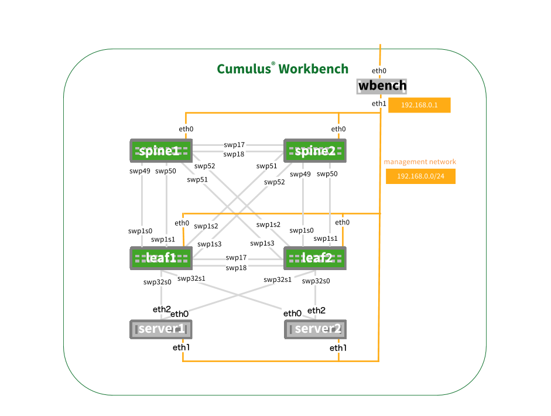

# Example Topologies
These topologies can be used to get started with topology converter.

## 2 Switch Topology
Simple 2 Switch connectivity at it's best. 4 links of fury.

## 2 Switch 1 Server Topology
Your basic MLAG scenario.

## 3 Switch Circular Topology
This topology can be linear if you shut one of the links somewhere in the topology. Useful for testing the propogation of routing updates and configurations.

## Cumulus Workbench 4 Switch 2 Server Topology
The famous topology from the Cumulus Workbench 4 switch workbench complete with identical port numberings. We've stolen the graphic here so be aware there is no eth0 interface on wbench in our simulation (for external connectivity you can apply a NAT rule across the vagrant interface). 

**Note:** Also keep in mind that in the real CW there is an out of band (OOB) switch that interconnects all of the management ports with the wbench server. We have simply created a hub in this topology so each device will see every other device as directly connected.

## Reference Topology
This topology can be used to simulate any feature offered by Cumulus Linux. It is not necessary to turn on each device in this topology, only those which you intend to use (to keep the simulation more manageable on a laptop). For more information on the reference topology see the [wiki page](https://wiki.cumulusnetworks.com/display/SAL/Reference+Topology). We provide examples to build this topology with either the Virtualbox or Libvirt providers (the topology is the same for each).

